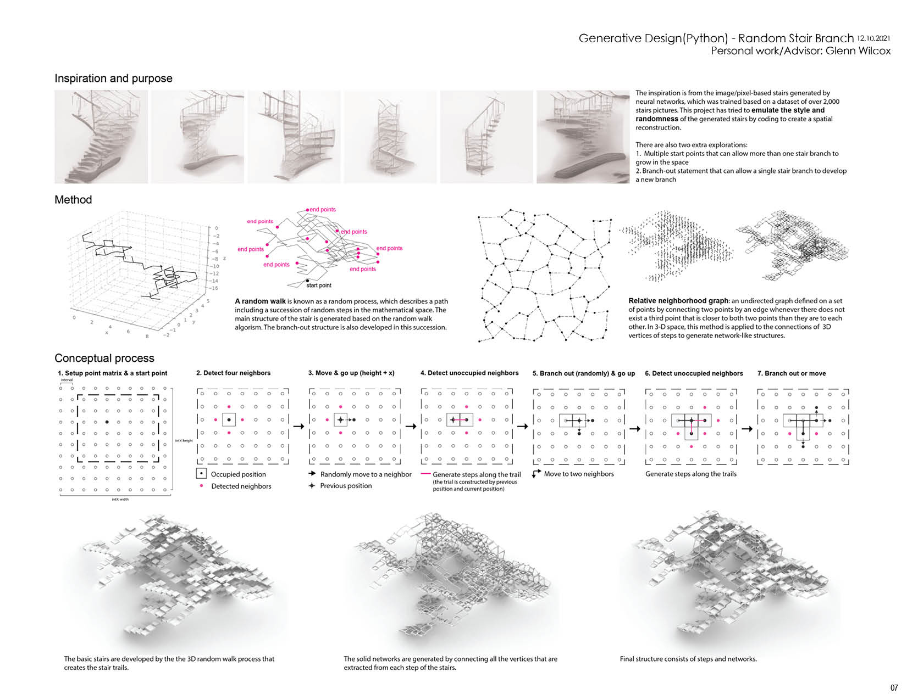
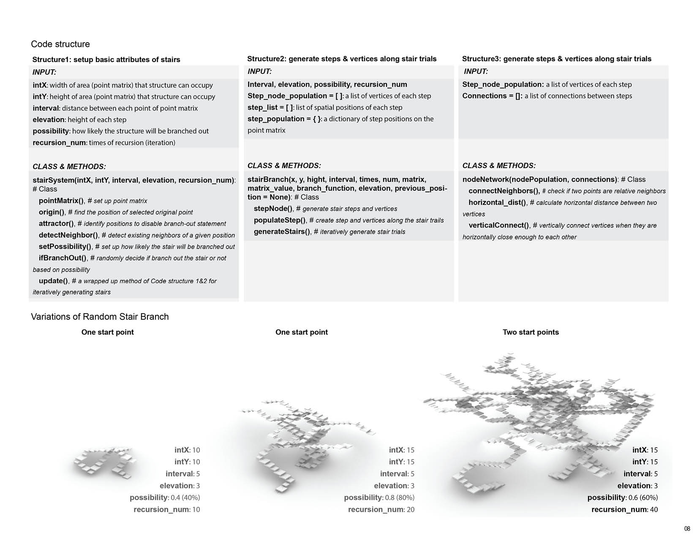

# Random_stair_branch
### ARCH 703 Virtual Engagement
| One start point  | One start point | Two start points |
| ---------------- | --------------- | ---------------- |
 |  | 

## Introduction
The inspiration is from the image/pixel-based stairs generated by neural networks, which was trained based on a dataset of over 2,000 stairs pictures. This project tried to emulate the style and randomness of the generated stairs by coding to create a spatial reconstruction.

## Features
1. Multiple start points can to set up to allow more than one stair branch to grow in the space.
2. Branch-out statement can allow a single stair branch to develop a new branch.

## Method
**Random walks**: A random walk is known as a random process, which describes a path including a succession of random steps in the mathematical space.

**Relative neighborhood graph**: an undirected graph defined on a set of points by connecting two points by an edge whenever there does not exist a third point that is closer to both two points than they are to each other.

## Requirement
Install Rhino 7

MAC OS

Install [Atom](https://flight-manual.atom.io/getting-started/sections/installing-atom/)

Install [rhino-python](https://atom.io/packages/rhino-python) in Atom

## Quick Start
MAC OS

To generate stairs in Rhino space:
1. Run the StartAtomEditorListener command from Rhino
2. Open random_stairs_v3.py in Atom. Press control + option + key R to run the script

To make animations:
1. Run the StartAtomEditorListener command from Rhino
2. Set up a new folder to save output images
3. In random_stairs_animation.py, modefy the path (the path of the new folder) for saving output images at line 427:
    folder = '/your/folder/'
Then, run the script.
4. Use other applications to generate gif or video.

## Posters

